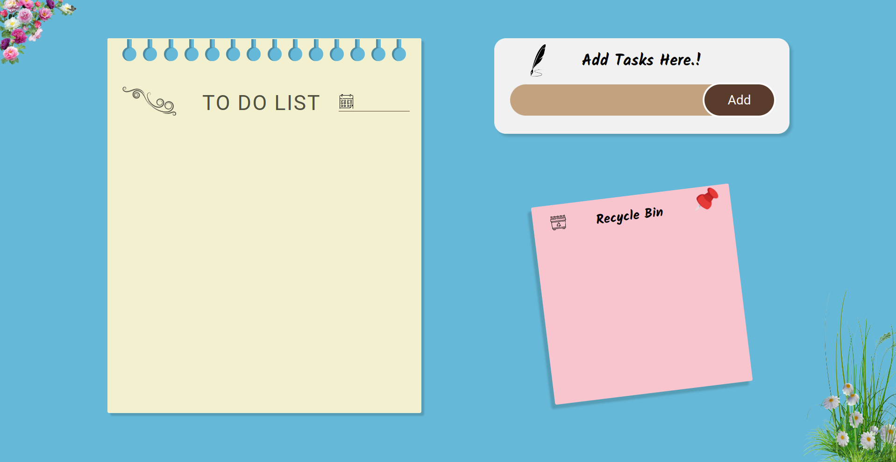

# To-Do

To-Do is a simple app to manage your to-dos. You can use it for all of life's to-dos, including grocery lists, projects at work, etc.

## [Live Preview](https://malihassandev.github.io/To-Do-List/)

## Features
- Add Task
- Delete Task
- View task creation date by hovering on task
- Restore task from recycle bin
- Ability to preserve tasks even after a browser reload
## Tech Stack
- Html 
- Javascript
- Css
## Outcome
- Learned use of browser local storage to store data.
- Learned to divide code into smaller modules based on SRP.
- Improved usage of immutable objects and variables.
## Navigation
- My next project [Secure Life](https://github.com/MAliHassanDev/Secure-Life)
- My previous project [Youtube Homepage](https://github.com/MAliHassanDev/YouTube-Website)
